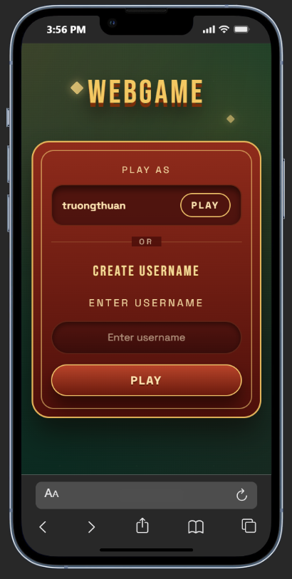
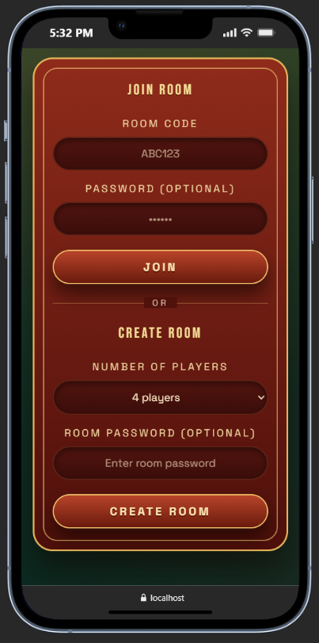

# Vietnamese-TienLen-Cardgame
Vietnamese Tien Len Card Game — rules, gameplay, and implementation details.

**HomePage:**

## Homepage flow
- If no user is stored in the browser: show the create-username form; the backend generates `user_id` and we store `user_id` + `name` in the browser.
- If a valid user exists: show options to continue with the current name (go to Lobby) or create a new user.

**Lobby**
The lobby lets players create a new room or join an existing one with a room code and optional password.

